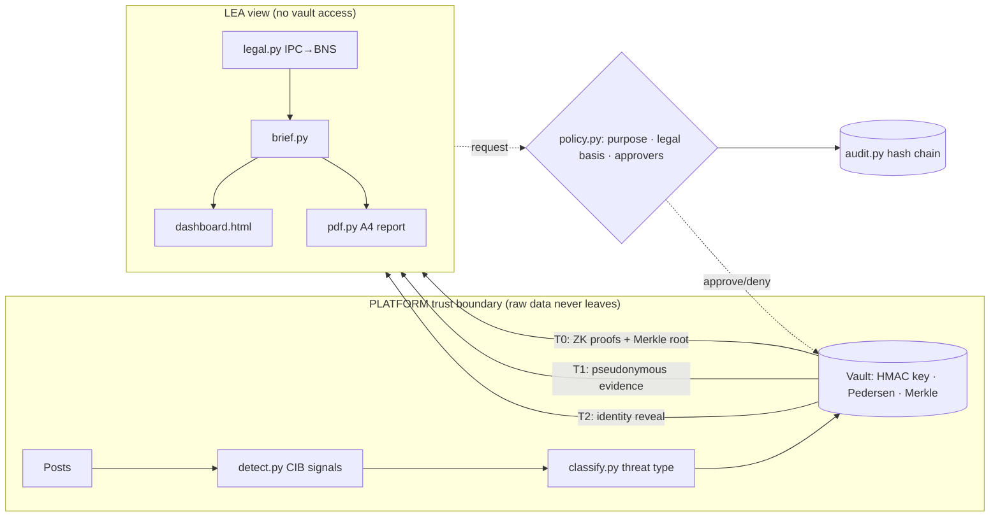

# 🔍 TitanSafe — Privacy-Preserving Social Media Threat Intelligence

> A cryptographically verifiable abstraction layer between social media platforms and law enforcement — giving LEAs exactly what they need to act, and nothing more.

---

## 👥 Team

| Field | Value |
|---|---|
| **Team Name** | TitanSafe |
| **Track** | AI |
| **Team Lead** | Shiv |
| **Members** | Narvin |

---

## 🎯 Problem Statement

Law enforcement agencies investigating coordinated incitement, doxxing, and election misinformation on social media face a binary choice: demand bulk raw data (violating India's **DPDP Act 2023** and exposing thousands of innocent users) or get nothing useful in time to prevent offline violence. There is no privacy-safe, cryptographically verifiable middle path.

→ Full context: [`docs/problem-statement.md`](docs/problem-statement.md)

---

## 💡 Solution

TitanSafe is a **zero-dependency, pure-Python** abstraction layer that runs inside the platform's trust boundary. It detects coordinated-inauthentic-behaviour (CIB) clusters in real time, then releases evidence through three cryptographically gated tiers:

| Tier | What LEA receives | Gate |
|---|---|---|
| **T0** Signals & proofs | Threat type, severity, CIB score, key phrases, BNS legal sections, **ZK proof that cluster has ≥ k accounts** (k ∈ 5/10/20/40), Merkle root. **No personal data.** | Purpose statement (auto-approved) |
| **T1** Pseudonymous evidence | Per-case pseudonyms, age/follower *bands*, redacted posts with Merkle inclusion proofs | Legal basis + nodal-officer approval + CIB score ≥ 0.60 |
| **T2** Identity reveal | user_id, handle, region — for named pseudonyms only | Court/magistrate order ref + **two distinct approvers** |
| **Never** | Phone, email, IP/device, DMs, social graph, posts outside flagged clusters | — |

Every disclosure is Merkle-anchored, hash-chain audited, and independently verifiable by the LEA.

→ Full details: [`docs/solution-overview.md`](docs/solution-overview.md)

---

## ✨ Key Features

- **Officer chat interface** — Non-technical officers open a browser, type the incident description or upload a FIR (`.txt`/`.pdf`/`.docx`), and get the full dashboard instantly — no command line needed.
- **Three-tier privacy-preserving disclosure** — ZK proofs (T0) → pseudonymous evidence (T1) → court-ordered identity reveal (T2), with cryptographic verifiability at every step.
- **Explainable CIB detection** — Union-find clustering with 5 transparent signals (burst, youth, text similarity, hashtag sync, low reach) and a phrase-weighted classifier. Every flag has a human-readable reason.
- **Cryptographic integrity chain** — Pedersen commitments, Schnorr range/linkage ZK proofs, sorted Merkle tree with identity-binding leaves, and a tamper-evident SHA-256 audit chain. Zero external dependencies.
- **Comprehensive LEA dashboard** — 11-section scrollable dark-terminal HTML dashboard: network graph, activity heatmap, platform analytics, risk gauge arcs, CIB sparklines, collapsible cluster cards, evidence search filter, and print CSS.
- **Seven realistic mock datasets (1000+ users each)** — `default`, `election_disinfo`, `communal_riot`, `journalist_doxxing`, `cyberattack_infra`, `stock_manipulation`, `exam_paper_leak` — each with 1000+ unique accounts and organic false-positive traps. Print-ready A4 PDF report with embedded SVG charts.

---

## 🏗️ Architecture



→ Full diagram and component table: [`docs/architecture.md`](docs/architecture.md)

---

## 🛠️ Tech Stack

| Category | Technologies |
|---|---|
| **Languages** | Python 3.10+ |
| **Web Interface** | Flask 3.x (optional — `pip install flask`) |
| **IBM Technologies** | IBM Bob (AI-assisted development, code review, architecture, refactoring) |
| **Crypto** | Pure-Python P-256 EC, Pedersen commitments, Schnorr ZK proofs, Merkle tree (from QBOM-ZT) |
| **Output** | Self-contained HTML/CSS/JS dashboard + A4 print report |
| **Testing** | pytest (6 tests) |
| **Optional extras** | `pypdf` for PDF uploads, `python-docx` for DOCX uploads |

---

## 📁 Repository Structure

```
TitanSafe/              ← Python package (all source code)
│   cli.py               ← CLI: demo / verify / datasets subcommands
│   app.py               ← Officer chat web interface (Flask) ← NEW
│   mock.py              ← 7 datasets × 1000+ users each
│   detect.py            ← CIB detection (union-find + 5 signals)
│   classify.py          ← Explainable threat classifier
│   abstraction.py       ← Vault: T0/T1/T2 tiers + ZK proofs
│   workflow.py          ← Case request loop + retention
│   policy.py            ← DPDP-aligned gate checks
│   audit.py             ← Tamper-evident SHA-256 audit chain
│   legal.py             ← IPC → BNS mapping
│   brief.py             ← Threat brief generator (LEA view only)
│   dashboard.py         ← Single-page scrollable HTML dashboard
│   pdf.py               ← Print-ready A4 HTML report
│   zt/                  ← ZK crypto primitives (ec, zk, merkle)
src/                     ← Source readme + .env.example
docs/                    ← Written documentation
│   problem-statement.md
│   solution-overview.md
│   architecture.md
│   setup-guide.md
demo/                    ← Demo artifacts
│   demo-video-link.txt
│   live-demo-url.txt
│   screenshots/
presentation/            ← Slide deck
submission.yaml          ← Structured submission metadata
tests/                   ← pytest test suite (6 tests)
pyproject.toml           ← Package config (Flask optional dep)
```

---

## ▶️ How to Run

> Full prerequisites and troubleshooting: [`docs/setup-guide.md`](docs/setup-guide.md)

### Option A — Officer Chat Interface (recommended for non-technical users)

```bash
# 1. Clone and install
git clone https://github.com/[your-org]/TitanSafe.git
cd TitanSafe
pip install -e ".[web]"        # installs Flask alongside the core package

# 2. Launch the web interface
python -m TitanSafe.app       # auto-opens http://localhost:5000 in your browser

# Optional: also install document upload support
pip install pypdf python-docx  # for .pdf and .docx FIR upload
```

Then in the browser:
1. Type the incident description or paste FIR text in the chat box
2. Optionally upload a `.txt` / `.pdf` / `.docx` FIR document
3. Click **▶ Analyse** — the system auto-detects the threat type, runs the full pipeline, and shows the live LEA dashboard

### Option B — Command Line

```bash
pip install -e .

# Run a dataset and generate outputs
python -m TitanSafe.cli demo --out out --pdf

# Open results in browser
#   out/dashboard.html        → full LEA dashboard
#   out/threat_report.html    → open and use Print → Save as PDF

# Verify all ZK proofs, Merkle anchors, identity bindings and audit chain
python -m TitanSafe.cli verify out

# List and try different datasets (each has 1000+ unique users)
python -m TitanSafe.cli datasets
python -m TitanSafe.cli demo --dataset communal_riot       --out out_riot      --pdf
python -m TitanSafe.cli demo --dataset election_disinfo    --out out_election  --pdf
python -m TitanSafe.cli demo --dataset journalist_doxxing  --out out_doxxing   --pdf
python -m TitanSafe.cli demo --dataset cyberattack_infra   --out out_cyber     --pdf
python -m TitanSafe.cli demo --dataset stock_manipulation  --out out_stock     --pdf
python -m TitanSafe.cli demo --dataset exam_paper_leak     --out out_exam      --pdf

# Run the test suite
pip install pytest && pytest tests/ -v
```

Expected: `6 passed` with all ZK proofs, Merkle anchors, identity bindings and audit chain verified.

---

## 🎬 Demo

| Artifact | Link |
|---|---|
| 📹 Demo Video | [See demo/demo-video-link.txt](demo/demo-video-link.txt) |
| 🌐 Live Demo | [Runs locally — see docs/setup-guide.md](docs/setup-guide.md) |
| 🖼️ Screenshots | [See demo/screenshots/](demo/screenshots/) |
| 📊 Presentation | [See presentation/](presentation/) |

---

## ⚠️ Known Limitations

- **Mock data only** — detection is heuristic; real deployment needs tuned NLP models and Hinglish/regional-script coverage.
- **Auto dataset selection is keyword-based** — the web app matches incident keywords to datasets; in production this would be replaced by a real platform data feed.
- **Pure-Python EC crypto is a research prototype** — not constant-time or security-audited. Use `coincurve` or `cryptography` (libsecp256k1 / OpenSSL) in production.
- **Legal mapping is indicative** — IPC/BNS sections must be confirmed by the investigating officer and public prosecutor. DPDP s.17 exemptions may allow broader State access; this is compliance-by-design, not a legal safe harbour.
- **PDF report is browser-printed HTML** — not a cryptographically signed document.
- **Regex-based redactor** — can be weakened by rich free-text; production would need NER.
- **In-memory session store** — the web app stores sessions in RAM; a production deployment would use Redis or a database.

---

## 🏆 What We're Most Proud Of

The **cryptographic integrity chain**: the same Pedersen-commitment / Schnorr ZK proof stack from QBOM-ZT is repurposed here to prove "at least k accounts in this threat cluster" without revealing the exact count. Combined with per-case HMAC pseudonyms (the same user looks different in every case — no cross-case linking) and Merkle-anchored post evidence, TitanSafe gives LEAs *mathematically verifiable* guarantees — not just a platform's word — that the evidence they received is authentic and hasn't been tampered with. The LEA can re-run `TitanSafe verify` at any time, with no platform cooperation, and confirm every proof still holds.

---

## 🖥️ Web Interface Walkthrough

| Step | What happens |
|---|---|
| Officer opens `http://localhost:5000` | Dark-terminal two-pane UI: chat on left, results on right |
| Types incident description or pastes FIR | Free text — "communal tension near mosque, gathering with weapons" |
| Uploads a `.txt`/`.pdf`/`.docx` FIR (optional) | Text is extracted and appended to the description |
| Clicks **▶ Analyse** | Pipeline runs in background; step-by-step log streams into chat |
| Analysis completes (~5–10 s) | Full LEA dashboard loads in the right panel automatically |
| Clicks **📄 PDF Report** tab | Switches to the A4 print report; **⎙ Print** saves as PDF |
| Clicks **✕ Reset** | Clears session for the next case |

Dataset auto-detection keyword map:
- `communal / riot / temple / mosque / weapons / gathering` → `communal_riot`
- `election / evm / vote / polling / voter / rigging` → `election_disinfo`
- `journalist / reporter / doxx / address leaked / phone shared` → `journalist_doxxing`
- Anything else → `default` (incitement + harassment + misinfo)

---

## 📊 Mock Datasets

| Name | Users | Scenario | Campaigns |
|---|---|---|---|
| `default` | **1,035** | Incitement + journalist harassment + health misinfo in organic cricket chatter | 3 (CRITICAL / HIGH / MEDIUM) |
| `election_disinfo` | **1,035** | Polling day — fake EVM-tampering claim + voter-suppression rumours | 2 (MEDIUM) |
| `communal_riot` | **1,020** | Friday afternoon — imminent incitement to gather with weapons + communal misinfo | 5 (CRITICAL + MEDIUM) |
| `journalist_doxxing` | **1,015** | Targeted doxxing of a freelance journalist (address + phone) + brigading campaign | 2 (HIGH / MEDIUM) |

Each dataset has ~8–10% hostile coordinated accounts buried in 90%+ organic noise, plus deliberate **organic false-positive traps** (trending hashtags, benign celebrity fan mentions) to validate precision.

---

## 📚 Detailed Documentation

| Document | Description |
|---|---|
| [`docs/problem-statement.md`](docs/problem-statement.md) | Background, who is affected, why existing solutions fall short |
| [`docs/solution-overview.md`](docs/solution-overview.md) | How it works step by step, key design decisions, IBM tech usage |
| [`docs/architecture.md`](docs/architecture.md) | System diagram, component table, data flow, security considerations |
| [`docs/setup-guide.md`](docs/setup-guide.md) | Prerequisites, installation, all CLI commands, troubleshooting |
| [`src/README.md`](src/README.md) | Package layout and source code guide |
| [`submission.yaml`](submission.yaml) | Structured submission metadata for evaluation pipeline |
