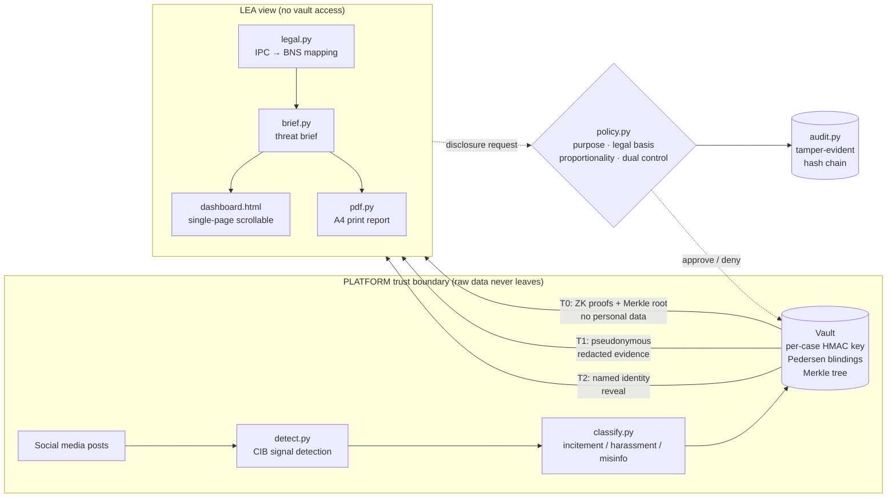

# Architecture

## System Architecture



## Components

| Component | Module(s) | Responsibility |
|---|---|---|
| CIB Detector | `detect.py`, `classify.py` | Union-find clustering on near-duplicate text + target convergence; phrase-weighted threat classification |
| Vault (platform boundary) | `abstraction.py` | Raw data custody; pseudonym generation; T0/T1/T2 disclosure; Merkle tree; ZK proofs |
| ZK Crypto | `zt/ec.py`, `zt/zk.py` | NIST P-256 curve arithmetic; Pedersen commitments; Schnorr range + linkage proofs |
| Merkle Tree | `zt/merkle.py` | Sorted Merkle tree; inclusion proofs per post |
| Policy Engine | `policy.py` | DPDP-aligned gate checks: purpose, legal basis, proportionality, approver count, pseudonym scope |
| Case Workflow | `workflow.py` | Request loop; tier dispatch; retention expiry |
| Audit Chain | `audit.py` | SHA-256 hash-chained audit log; chain verification |
| LEA Brief | `brief.py` | Markdown + JSON threat brief from LEA view (no vault access) |
| Dashboard | `dashboard.py` | Self-contained single-page HTML dashboard; 8 sections; SVG charts; IntersectionObserver nav |
| PDF Report | `pdf.py` | Print-ready A4 HTML report for formal submissions |
| Mock Datasets | `mock.py` | 4 named deterministic datasets with organic false-positive traps |
| CLI | `cli.py` | `demo` / `verify` / `datasets` subcommands |

## Data Flow

1. Platform ingests posts → `detect.py` runs union-find CIB clustering inside the trust boundary.
2. `classify.py` assigns threat type and severity to each cluster (with key phrase evidence).
3. `Vault.__init__` generates per-case HMAC pseudonyms, Pedersen commitments per cluster, and builds the Merkle tree with identity-binding leaves.
4. `Vault.attest()` (T0) exports: cluster metadata, ZK "at least k accounts" proofs, Merkle root. **No personal data.**
5. LEA receives T0 via `brief.py` and `dashboard.py`. Makes a T1 request with legal basis + nodal approval.
6. `policy.py` checks proportionality (CIB score ≥ 0.60), legal basis, approver identity.
7. `Vault.t1()` releases pseudonymous accounts (age/follower bands) and redacted posts with Merkle inclusion proofs.
8. LEA makes a T2 request with court order ref + two distinct approvers.
9. `Vault.t2()` releases real user IDs and handles for named pseudonyms only.
10. All steps are recorded in the tamper-evident `AuditLog`. LEA can run `TitanSafe verify` at any time to re-verify the full chain without any platform access.

## Cryptographic Integrity Chain

```
T0 (public)          T1 (gated)                    T2 (court-ordered)
────────────         ──────────────────────────     ──────────────────────
Merkle root    ←──── post Merkle inclusion proof    identity_commitment
ZK proofs             └─ leaf = hash(idc, pid, s)  └─ hash(psn, uid, salt)
accounts_commitment        ↑ verifiable against          ↑ verifiable against
                           T0 root                       T1 identity_commitment
```

## Security Considerations

- **Raw data never leaves the Vault.** `brief.py`, `dashboard.py`, and `pdf.py` consume only the `lea_view()` dict, which contains no phone numbers, emails, IP addresses, DMs, or social graphs.
- **Per-case pseudonyms** prevent cross-case identity linking even with multiple case files.
- **ZK proofs** bind the LEA's cluster-scale claim to the platform's committed count — the platform cannot later claim "only 3 accounts" if it committed to ≥ 40.
- **Merkle inclusion proofs** on each post mean the platform cannot substitute, delete, or alter evidence after T0 attestation.
- **K-anonymity floor:** clusters below `min_accounts=5` are never surfaced.
- **Audit chain integrity** is verifiable by the LEA without any platform cooperation.

## Scalability Notes

The pure-Python EC crypto is a research prototype suitable for hackathon demonstration.
For production:
- Replace hand-rolled EC with `coincurve` or `cryptography` (libsecp256k1 / OpenSSL backed).
- The `Vault` is stateless per-case and can be sharded by `case_id`.
- The LEA-view generation (`brief.py`, `dashboard.py`) is read-only and horizontally scalable.
- The audit log should be backed by an append-only store (e.g., PostgreSQL with row-level security).
